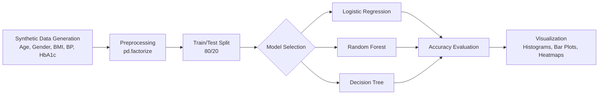

# ML Reference Notebook

End-to-end machine learning reference implementation covering data generation, preprocessing, model training, evaluation, and visualization using a diabetes prediction example.

## Overview

A self-contained ML cheatsheet notebook that walks through the complete supervised learning workflow: generating synthetic patient data, encoding categorical features, training multiple classifiers (Logistic Regression, Random Forest, Decision Tree), evaluating accuracy, and producing diagnostic plots. Designed as a quick-reference template for common ML tasks.



## Covered Topics

- **Data generation**: Synthetic patient records with NumPy random sampling
- **Feature encoding**: `pd.factorize` for categorical variables (Gender, Status)
- **Train/test split**: scikit-learn `train_test_split` with fixed random state
- **Classification models**: Logistic Regression, Random Forest, Decision Tree
- **Evaluation**: `accuracy_score` comparison across models
- **Visualization**: Distribution histograms (HbA1c, BMI), status bar plots, correlation heatmaps

## Quick Start

```bash
git clone https://github.com/Akasxh/ML.git
cd ML
jupyter notebook Diabetes.ipynb
```

## Project Structure

```
ML/
├── Diabetes.ipynb    # Full ML workflow reference notebook
├── LICENSE
└── README.md
```

## Tech Stack

- **ML**: scikit-learn (LogisticRegression, RandomForestClassifier, DecisionTreeClassifier)
- **Data**: pandas, NumPy
- **Visualization**: matplotlib, seaborn
